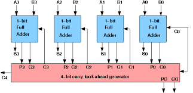

to implement a quantum carry look ahead adder, we first need to understand the classical one. 



the carry propagation is given by
```
Pi = Ai ⊕ Bi
```
the carry generation is given by 
```
Gi = Ai . Bi
```

### Using these we can find the carry and the sum generated

The sum is given by : 

```
Si = Pi ⊕ Ci
```

While the Carry (C {i+1}) is given by : 

```
C { i+1 } = Gi + Pi . Ci 
```

Using these we can implement them in a quantum system using the mcx, cx and ccx gates. 

However we would still need 1 extra - auxilliary bit to store the carry generation. The bit Ai would be modified to give the Propagation. Then all the carry would be calculated. Finally after a barrier, All the respective sums would be calculated and then measured. 

Also for a 4 bit adder, We would be needing 26 gates. This can be understood as follows : 

1) 2 gates for each bit . For Carry Propagation and Generation => 8 gates
2) (2+3+ ... n+1) gates to determine carry generated. Thus 2+3+4+5 = 14 => 14 gates
3) 1 gate each for sum generated. => 4 gates

Thus 8 + 14 + 4 = 26 gates. 

Another Keen observation would lead us to an interesting result : 

The formula can be generalised for n bit number. 
```
1) 2n gates
2) (((n+1)*(n+2)) / 2) - 1
3) n gates
```
thus giving us n(n+9)/2 gates in total 